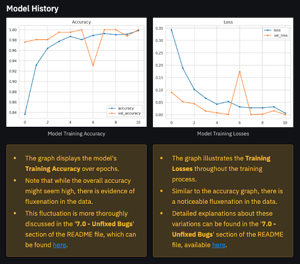

# **Mildew Detection: Cherry Leaves**

The **Mildew Detection: Cherry Leaves** app determines the health status of cherry leaves by identifying whether they are healthy or infected with powdery mildew. By analyzing an image of a cherry leaf, the app provides a prediction regarding its condition.

This application is powered by a supervised machine learning model that employs single-label binary classification. The binary classifier categorizes the leaf as either healthy or infected with powdery mildew based on the image analysis.

The project can be viewed live [here](https://cl-mildew-detection-gh-fdbcf8e2f112.herokuapp.com/)

## 1.0 - Dataset Content

- The dataset is sourced from [Kaggle](https://www.kaggle.com/codeinstitute/cherry-leaves). This dataset was provided by Code Institute.
- The dataset contains over 4,000 images from the client's crop fields, depicting both healthy cherry leaves and those infected with powdery mildew—a fungal disease affecting many plant species. The cherry plantation crop is one of the finest products in their portfolio, and the company is concerned about supplying the market with a compromised-quality product.

## 2.0 - Business Requirements

Farmy & Foods' cherry plantations are facing a challenge with the presence of powdery mildew. Currently, the process involves manual verification to determine if a given cherry tree contains powdery mildew. An employee spends around 30 minutes per tree taking a few samples of leaves and visually verifying if the tree is healthy or has powdery mildew. If powdery mildew is detected, the employee applies a specific compound to eliminate the fungus, which takes about a minute. The company has thousands of cherry trees located on multiple farms across the country. As a result, this manual process is not scalable due to the time spent on inspection.

To save time in this process, the IT team suggested an ML system that detects instantly, using an image of the leaf, whether it is healthy or has powdery mildew. A similar manual process is in place for other crops for detecting pests, and if this initiative is successful, there is a realistic chance to replicate this project for all other crops. The dataset is a collection of cherry leaf images provided by Farmy & Foods, taken from their crops.

1. **The client is interested in conducting a study to visually differentiate a healthy cherry leaf from one with powdery mildew.**
2. **The client is interested in predicting if a cherry leaf is healthy or contains powdery mildew.**

## 3.0 - Hypothesis and Validation

### 3.1 - Hypothesis

We hypothesize that cherry leaves infected with powdery mildew exhibit distinct visual characteristics, such as a white, powdery appearance, differentiating them from healthy leaves.

### 3.2 - How to Validate?

- By conducting a study that shows how to visually differentiate a healthy cherry leaf from one that contains powdery mildew.
- By assessing the capability to predict if a cherry leaf is healthy or contains powdery mildew.

An image montage suggests that infected leaves typically show a white, powdery surface. Studies involving average image analysis, variability analysis, and differences between averages are expected to reveal patterns that distinguish healthy leaves from those affected by powdery mildew.

## 4.0 - The Rationale for Mapping the Business Requirements to Data Visualizations and ML Tasks

### 4.1 - Business Requirements Rationale

**Business Requirement 1:** The client is interested in conducting a study to visually differentiate a healthy cherry leaf from one with powdery mildew.

This requirement is focused on visual analysis, involving the creation of various data visualizations. Tasks include data collection, image analysis, and generating visual representations to help the client observe differences between healthy and infected leaves. Therefore, this requirement can be labeled as **Data Visualization**.

**Business Requirement 2:** The client is interested in predicting if a cherry leaf is healthy or contains powdery mildew.

This requirement targets predictive modeling, which involves machine learning. Tasks related to this include developing and training a classification model, optimizing it for accuracy, and validating its performance to ensure accurate predictions as per the client's needs. Therefore, this requirement can be labeled as **Classification**.

### 4.2 - Epics and Tasks

As a collective of these two objectives, the project can be broken down into five different epics, which are listed below along with the tasks that need to be completed for each epic.

#### 4.2.1 - Information Gathering and Data Collection

This epic focuses on understanding the client's needs and gathering the necessary data, including all cherry leaf images. It is primarily aimed at addressing **Data Visualization**.

- **Task 1:** Collect cherry leaf images from the appropriate dataset on Kaggle.

#### 4.2.2 - Data Visualization, Cleaning, and Preparation

This epic deals with processing the gathered data to ensure it is properly prepared for effective modeling. It is also focused on **Data Visualization**.

- **Task 2:** Analyze the data to ensure each image is the same size. Split the dataset into training, testing, and validation sets.
- **Task 3:** Create visual data representations for the client, including average images, variability images, and image montages (for both healthy and infected leaves). Completing this task will satisfy **Business Requirement 1**.

#### 4.2.3 - Model Training, Optimization, and Validation

This epic is concerned with the model, ensuring it meets the necessary standards and can classify whether a leaf image is infected with powdery mildew. It is focused on the **Classification** objective.

- **Task 4:** Develop and train a classification neural network on the provided dataset. Optimize the model to achieve a minimum accuracy of at least 97%.
- **Task 5:** Validate the model and analyze its performance, ensuring it meets the client's goals and requirements.

#### 4.2.4 - Dashboard Planning, Design, and Development

This epic addresses how the observations and predictive interface will be presented to the client, with a focus on both **Data Visualization** and **Classification**. It leans more towards Data Visualization but also includes the creation of an interface for leaf health prediction.

- **Task 6:** Design and develop a dashboard using Streamlit, meeting the client's requirements. The dashboard should include a project summary, hypothesis, machine learning performance metrics, leaf observations, and an interactive predictive interface for testing. It should fulfill both business requirements and be sufficiently interactive.

#### 4.2.5 - Dashboard Deployment and Release

This epic focuses on the deployment and execution of the project, ensuring that the client can access the information securely, according to the NDA. It addresses both **Data Visualization** and **Classification**.

- **Task 7:** Deploy the dashboard to an appropriate hosting platform (such as Heroku) so that the client can access the project. Ensure that access to the dashboard is restricted to the client, in compliance with the NDA.

## 5.0 - ML Business Case

### 5.1 - Business Objectives

Farmy & Foods aims to enhance the quality assurance process of their cherry plantations by addressing the challenge of powdery mildew found on the cherry leaves, which affects their crops. As established, there are two business requirements; however, here are the key business objectives for this machine learning (ML) project:

1. **Automate Mildew Detection:** Reduce dependency on manual labor for inspecting cherry leaves by implementing an automated solution that uses machine learning to detect powdery mildew.

2. **Improve Crop Quality:** Ensure that only healthy, mildew-free cherries reach the market, thereby maintaining the brand's reputation for quality and reducing the risk of customer dissatisfaction.

3. **Optimize Operational Efficiency:** Streamline the inspection process across multiple farms, saving time and resources while improving scalability.

### 5.2 - Business Benefits

Based on meeting the Business Objectives, the successful implementation of this ML project is expected to deliver the following business benefits:

1. **Increased Productivity:** Automating the inspection process will allow Farmy & Foods to monitor more trees in less time, freeing up employees to focus on other critical tasks.

2. **Cost Reduction:** By reducing the need for extensive manual inspections and minimizing crop loss due to undetected mildew, the company will achieve significant cost savings.

3. **Enhanced Decision-Making:** The data-driven approach will provide actionable insights, allowing Farmy & Foods to make informed decisions about crop management and mildew prevention.

4. **Market Differentiation:** Ensuring that only the highest-quality produce reaches the market will strengthen the company’s position as a premium brand, enhancing customer trust and loyalty.

### 5.3 - Business Risks and Mitigation

#### Risk 1: Model Accuracy and Reliability
- **Risk:** The ML model may not achieve the desired level of accuracy (97%), leading to incorrect classifications of cherry leaves and potential crop losses.

- **Mitigation:** To mitigate this risk, rigorous model validation and tuning will be undertaken, including cross-validation and testing on unseen data. The model will only be deployed once it consistently meets or exceeds the 97% accuracy threshold.

#### Risk 2: Resistance to Technological Change
- **Risk:** Employees may resist adopting the new technology due to unfamiliarity with machine learning and fear of job displacement.

- **Mitigation:** Comprehensive training programs and workshops will be provided to ensure employees are comfortable using the new system. Emphasizing the role of technology in augmenting rather than replacing human labor will help ease the transition.

#### Risk 3: Data Privacy and Security
- **Risk:** The data provided by the client is under an NDA (Non-Disclosure Agreement), which imposes strict limitations on data sharing and usage.

- **Mitigation:** Access to the data will be restricted to authorized personnel only. All project participants will be briefed on the NDA terms, and data handling protocols will be established to ensure compliance with the agreement.

#### Risk 4: Model Deployment and Integration
- **Risk:** The model's large size, resulting from high-resolution images, may complicate deployment and integration into existing systems.

- **Mitigation:** To address this risk, optimization techniques such as model compression and efficient deployment strategies will be employed. A thorough deployment plan will be developed to ensure seamless integration with the client's existing systems.

### 5.4 - Conclusion

The **Mildew Detection: Cherry Leaves** project aims to provide an efficient and reliable solution for detecting powdery mildew on cherry leaves. By automating the inspection process and leveraging machine learning, the project seeks to enhance crop quality, improve operational efficiency, and deliver significant business benefits to Farmy & Foods. Careful risk assessment and mitigation strategies will ensure the project's success, delivering long-term value to the business.

## 6.0 - Dashboard Design and Outcome 

### 6.1 - Page 1: Project Summary

#### 6.1.1 - Page Design

This page is divided into four sections that collectively provide a comprehensive introduction to the project, giving the user an overview and insight into the project's objectives and requirements. The sections are as follows:

- **General Information**
    - Powdery mildew is a fungal disease affecting the cherry plantations at Farmy & Foods, posing a threat to the quality of their produce.
    - The current process involves manually inspecting each cherry tree by visually examining leaf samples. An employee spends around 30 minutes per tree for inspection, with an additional minute required if treatment is needed.
    - Due to the extensive number of cherry trees across multiple farms, this manual inspection process is not scalable.
    - The IT team suggests implementing a machine learning system using a neural network model to accurately classify images of cherry leaves as either healthy or infected with powdery mildew.

- **Additional Information**
    - This section provides a brief explanation of where to find more detailed information about the project.
    - [Click here to view the README file](https://github.com/GabrielH-02/Mildew-Detection-CL).

- **Project Dataset**
    - The dataset consists of over 4,000 images from the client's crop fields, depicting both healthy cherry leaves and those affected by powdery mildew.  
    - It can be accessed on [Kaggle](https://www.kaggle.com/codeinstitute/cherry-leaves).

- **Business Requirements**
    - The project has **two business requirements**:
        1. The client wants to understand how to visually differentiate a healthy cherry leaf from one infected with powdery mildew.
        2. The client is interested in predicting whether a cherry tree is healthy or infected with powdery mildew.

#### 6.1.2 - Page Outcome

### 6.2 - Page 2: Leaf Observations

#### 6.2.1 - Page Design

This page consists of three sections that provide insights into the visualization and analysis aspects of the project. Its main purpose is to visually demonstrate the differences between a healthy leaf and one infected with powdery mildew, addressing **Business Requirement 1**. The sections are:

- **Business Requirement**
    - The client seeks to study how to visually differentiate a healthy cherry leaf from one infected with powdery mildew.

- **Checkbox 01**
    - Visuals comparing healthy and infected cherry leaves, highlighting the visual differences between them.

- **Checkbox 02**
    - An image montage displaying both healthy cherry leaves and mildew-infected cherry leaves.

#### 6.2.2 - Page Outcome

### 6.3 - Page 3: Mildew Detector

#### 6.3.1 - Page Design

This page contains three sections that together provide user interaction and a predictive interface to assess the health status of cherry leaves. The primary purpose of this page is to determine whether a cherry leaf is healthy or infected with powdery mildew, thereby addressing **Business Requirement 2**. The sections are:

- **Business Requirement**
    - The client is interested in predicting whether a cherry leaf is healthy or infected with powdery mildew.

- **Dataset Download**
    - A link to download a set of mildew-infected cherry leaf images and healthy cherry leaf images for live prediction.

- **Predictive Interface**
    - A file uploader widget allowing users to upload multiple cherry leaf images.
    - Upon uploading, the image will be displayed along with a prediction statement indicating whether the leaf is infected with powdery mildew or healthy, along with the associated probability.
    - A table showing the image name and prediction results.
    - A download button to export the results table.

#### 6.3.2 - Page Outcome

### 6.4 - Page 4: Hypothesis and Validation

#### 6.4.1 - Page Design

This page consists of two sections that present the project’s hypothesis and validate the project's findings. Additionally, it provides statements to simplify observations. The sections are:

- **Hypothesis**
    - We suspect that cherry leaves infected with powdery mildew have distinct visual characteristics, such as a white powdery appearance, that differentiate them from healthy leaves.
    - An image montage suggests that infected leaves typically show a white, powdery surface. Studies involving average image analysis, variability analysis, and differences between averages are expected to reveal patterns that distinguish healthy leaves from those affected by powdery mildew.

- **Validation**
    - This section clearly explains how the project was validated in alignment with the client's requirements and guidelines.

#### 6.4.2 - Page Outcome

### 6.5 - Page 5: ML Performance Metrics

#### 6.5.1 - Page Design

This page is divided into two sections that provide informative and insightful perspectives on the machine learning model’s performance. The sections are:

- **Metrics of Model Training and Evaluation**
    - Details of the performance metrics used during the model's training and evaluation phases.

- **Visuals of Model Performance and Accuracy**
    - Graphical representations of the model's performance and accuracy, providing a visual understanding of the results.

#### 6.5.2 - Page Outcome

## 7.0 - Unfixed Bugs

### 1. Model Training Accuracy and Loss Behavior

**Issue**: On the ML Performance Metrics page, the model's accuracy and loss values peak at a certain point (e.g., epoch 6). This indicates there may be problems with how the model is learning. It suggests that the model's performance is either dropping suddenly or changing unpredictably.

**Potential Causes**:
- **Overfitting or Underfitting**: The model might be too focused on the training data or not learning enough from it.
- **Learning Rate Issues**: The learning rate could be too high or too low, affecting how well the model learns.
- **Model Architecture**: The model’s design might not fit the task well.
- **Data Quality**: Problems with data quality or processing could be affecting the model's learning.

**Current Status**: The exact cause of this issue is not yet clear. I am currently checking the model's settings, learning rate, design, and data handling to resolve this problem.

### Other Unfixed Bugs

**Current Status**: At this time, no additional bugs or issues have been identified in the project beyond those already mentioned. The project appears to be functioning as expected with no further known problems.

## 8.0 - Deployment

### Heroku

- The app live link is: [Here](https://cl-mildew-detection-gh-fdbcf8e2f112.herokuapp.com/)
- Set the `runtime.txt` Python version to a [Heroku-20](https://devcenter.heroku.com/articles/python-support#supported-runtimes) stack currently supported version.
- The project was deployed to Heroku using the following steps:

1. Log in to Heroku and create an app.
2. On the Deploy tab, select GitHub as the deployment method.
3. Enter your repository name and click Search. Once it is found, click Connect.
4. Select the branch you want to deploy, then click Deploy Branch.
5. The deployment process should happen smoothly if all deployment files are fully functional. Click the Open App button at the top of the page to access your app.
6. If the slug size is too large, add large files not required for the app to the `.slugignore` file.

## 9.0 - Main Data Analysis and Machine Learning Libraries

This project leverages several key libraries for data analysis, visualization, and machine learning:

- **NumPy**: Used for numerical computations and handling large, multi-dimensional arrays and matrices.
- **Pandas**: Employed for data manipulation and analysis, providing data structures and operations to manipulate numerical tables and time series.
- **Matplotlib**: A plotting library used to create static, animated, and interactive visualizations.
- **Seaborn**: Built on top of Matplotlib, this library is used for making statistical graphics with improved aesthetic design and functionality.
- **Plotly**: Utilized for creating interactive plots and visualizations that can be embedded into web applications.
- **Streamlit**: A framework for building and deploying data-driven applications, particularly useful for creating interactive dashboards.
- **Scikit-learn**: A machine learning library that provides simple and efficient tools for data mining and data analysis, including classification, regression, clustering, and more.
- **TensorFlow**: An open-source library developed by Google for deep learning and neural network-based tasks.

## 10.0 - Credits

### 10.1 - Content

- [Code Institute; **Coursework**](https://learn.codeinstitute.net/courses/course-v1:code_institute+CI_DA_ML+2021_Q4/courseware/d186ae95191f48e9a2151559c7e6f85d/771e4d181ce0413c87572c1baa903190/): The knowledge gained from the coursework, particularly from the [Data Analytics And Machine Learning](https://learn.codeinstitute.net/courses/course-v1:code_institute+CI_DA_ML+2021_Q4/courseware/d186ae95191f48e9a2151559c7e6f85d/771e4d181ce0413c87572c1baa903190/) module, was instrumental in understanding the concepts required for this project. Additionally, the basics of understanding **Streamlit** and **Jupyter Notebooks** were significantly enhanced by the content from [Introduction to Predictive Analytics And Machine Learning](https://learn.codeinstitute.net/courses/course-v1:CodeInstitute+PA101+2021_Q4/courseware/e30c43d88866496180a8adc30536585d/426641895288496383e39a1c50f5a8b2/).

- [Code Institute: **Handbook: Mildew Detection in Cherry Leaves**](https://learn.codeinstitute.net/courses/course-v1:CodeInstitute+PA_PAGPPF+2021_Q4/courseware/bde016cdbd184cdeafd341a73807e138/bd2104eb84de4e48a9df6f685773cbf2/): This handbook was extremely helpful in developing my project, as it provided the original idea, the business requirements, and all the information about the client and the expectations for this dashboard project. Additionally, the provided Kaggle dataset, which can be found [here](https://www.kaggle.com/datasets/codeinstitute/cherry-leaves?select=cherry-leaves), was essential for the project's success.

- [Code Institute: **Malaria Detector**](https://learn.codeinstitute.net/courses/course-v1:code_institute+CI_DA_ML+2021_Q4/courseware/07a3964f7a72407ea3e073542a2955bd/29ae4b4c67ed45a8a97bb9f4dcfa714b/): This project was a great help in developing my own project as it effectively visualized how a Machine Learning project comes together. The design and code assisted in the creation of this project, helping to adapt it to the client's requirements and needs.

- [Code Institute; **Mildew Detection Template**](https://github.com/Code-Institute-Solutions/milestone-project-mildew-detection-in-cherry-leaves): This repository was crucial in assisting with this project, as it served as the foundation upon which my project was built.

- [Patrick Loeber; YouTube Channel](https://www.youtube.com/@patloeber): This YouTube channel was particularly helpful for understanding how to fit a model and structure a Streamlit project. The videos that were most beneficial to me include [Build A Machine Learning Web App From Scratch](https://www.youtube.com/watch?v=xl0N7tHiwlw) and [5 Machine Learning BEGINNER Projects (+ Datasets & Solutions)](https://www.youtube.com/watch?v=bYSeGBOLzqw).

- [Streamlit Documentation](https://docs.streamlit.io/): This was an invaluable resource in developing a Streamlit dashboard application.

### 10.2 - Acknowledgements

- I would like to acknowledge Code Institute for providing me with the necessary information and resources to develop this project, as well as my four previous projects.
- A special thanks to the Code Institute Tutor Support Team, who assisted me during the challenges I faced with this project.
- I appreciate my mentor, **Precious Ijege**, for his help and guidance on this project.
